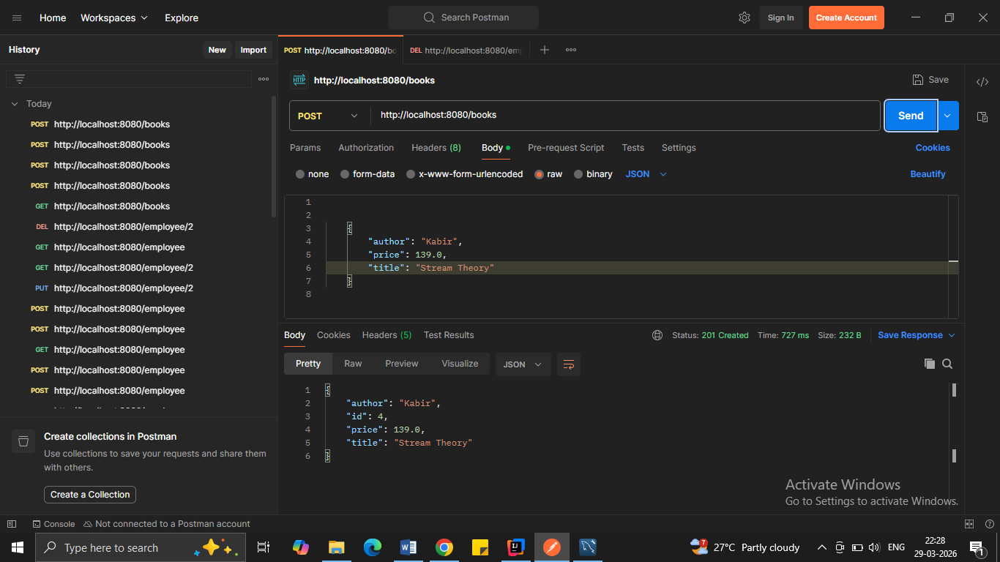
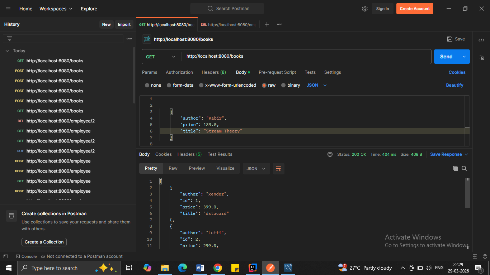
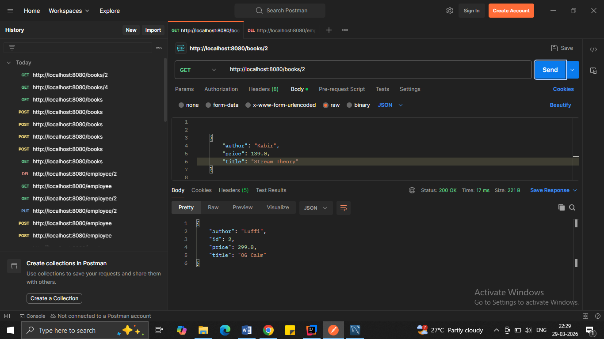
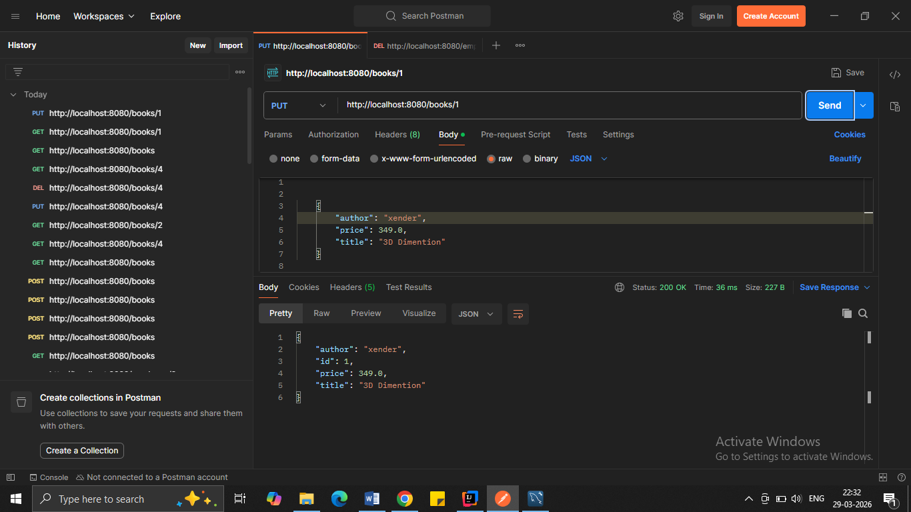
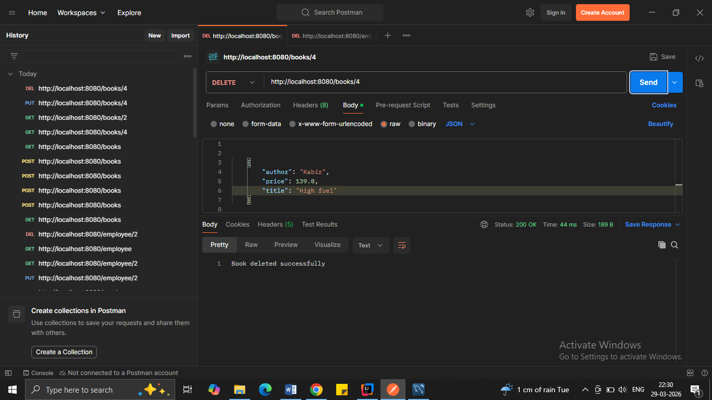

# 📚 Bookstore System

## 📌 Overview
This is a backend REST API project built using Java and Spring Boot to manage books. It supports creating, updating, deleting and viewing books.

---

## 🚀 Tech Stack
- Java
- Spring Boot
- Spring Data JPA (Hibernate)
- MySQL
- Maven

---

## ⚙️ Features
- Create, update and delete books
- DTO pattern implementation
- Layered architecture (Controller-Service-Repository)
- Global exception handling
- Request validation using @Valid

---

## 🔗 API Endpoints

| Method | Endpoint            | Description         |
|--------|---------------------|---------------------|
| POST   | /books              | Create new book     |
| GET    | /books              | Get all books       |
| GET    | /books/{id}         | Get book by ID      |
| PUT    | /books/{id}         | Update book         |
| DELETE | /books/{id}         | Delete book         |

---

## 🧪 Testing
APIs tested using Postman.

---

## 📸 Screenshots

### Create Book (POST)

### Get All Books (GET)

### Get Book by ID (GET)

### Update Book (PUT)

### Delete Book (DELETE)

---

## ▶️ How to Run
1. Clone the repository
2. Open in IntelliJ / Eclipse
3. Configure database in `application.properties`
4. Run the application using:
